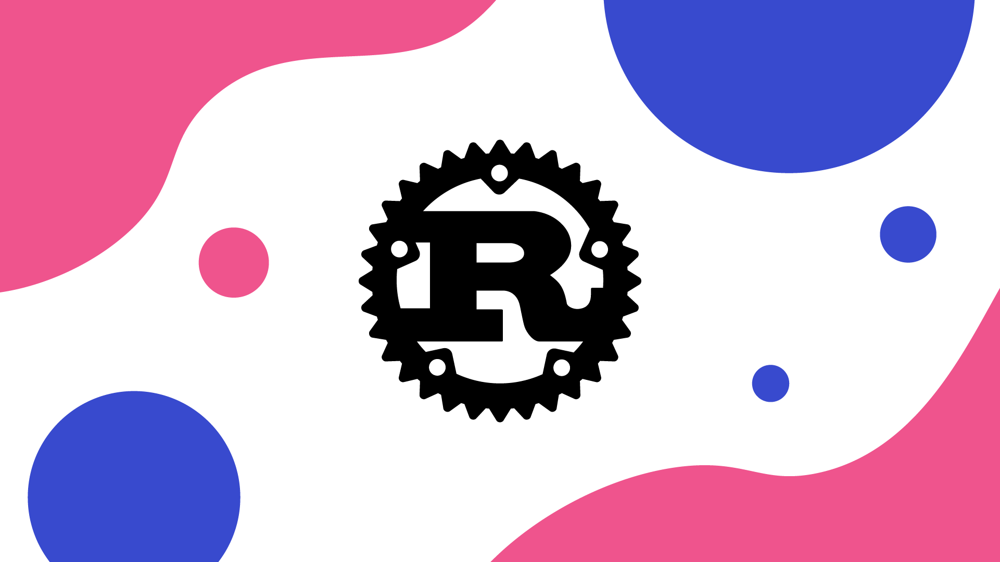

# Rust-Crash-Course

A quick start for the Rust Language



## About Rust

[Rust](https://www.rust-lang.org/) is a multi-paradigm systems programming language focused on safety, especially safe concurrency. Rust is syntactically similar to C++, but is designed to provide better memory safety while maintaining high performance.

Rust was originally designed by Graydon Hoare at Mozilla Research, with contributions from Dave Herman, Brendan Eich, and others.

Rust was the "most loved programming language" in the Stack Overflow Developer Survey for 2016, 2017, and 2018.

## Traversing through the Course

The folders are named in an order and the files in there have comments to explain what's going on.

This course considers that you already have some experience with programming in general and is going to help you get your feet wet with Rust.
This is not meant to be your first attempt at programming as it assumes that you know whats going on in general although its very basic.

## To Run a .rs Program

```
$ rustc FILE_NAME.rs
$ ./FILE_NAME
```

## Creating a New Project

We are going to use **cargo** to create a new project.

```
$ cargo new PROJECT_NAME
```

### What's Cargo?

Cargo is a tool that _Rustaceans_ use to help manage their Rust projects. Cargo is currently in a pre-1.0 state, and so it is still a work in progress. However, it is already good enough to use for many Rust projects, and so it is assumed that Rust projects will use Cargo from the beginning.

Cargo manages three things: building our code, downloading the dependencies our code needs, and building those dependencies. At first, our program doesn’t have any dependencies, so we’ll only be using the first part of its functionality. Eventually, we’ll add more. Since we started off by using Cargo, it'll be easy to add later.

_Cargo_ to _Rust_ is similar to what _pip_ is to _Python_ or what _npm_ is to _Node_.

### What's Cargo.toml

The Cargo.toml file for each package is called its manifest. Every manifest file consists of one or more sections.

Its going to take care of all your dependencies, etc.

Its very similar to what _package.json_ is, if you have ever done _NodeJS_.

### Compiling & Building your Project

In your project folder, run

```
$ cargo run build
```

This is going to create a _target_ folder which is the actual output folder that you'd want to distribute.

Now go to the debug folder and run the executable file.

To just check for the Output and not build the project everytime we just use...

```
$ cargo run
```

## Note

I do not take credit for this course these are just the notes I took down while watching a tutorial.

All credit goes to this [video-tutorial](https://youtu.be/KDn_j48yoAo) by Chris Hawkes (@chawk).
